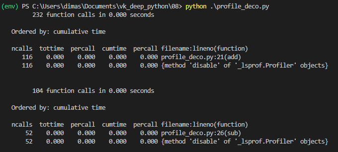

# Сравнение использования weakref и slots

Замерялось время создания 500000 экземпляров и время чтения/изменения их атрибутов.

Больше всего времени ушло на создание ссылок (weakref), но работа с атрибутами экземпляров класса CarWeakRef заняла меньше времени, чем у других классов.

Использование Slots дало выигрыш по времени при создании экземпляров, но работа с атрибутами экземпляров класса CarSlots заняла примерно столько же времени, сколько и с атрибутами экземпляров класса Car.

# Профилирование вызовов и памяти

Профилирование памяти проводилось для тестов на 100000 экземпляров.

На скриншоте видно, что использование Slots и Weakref дало выигрыш по памяти (потребовалось 34-35 Мб вместо 39 Мб).

Профилирование вызовов проводилось для тестов на 500000 экземпляров.

# Декоратор для профилирования

